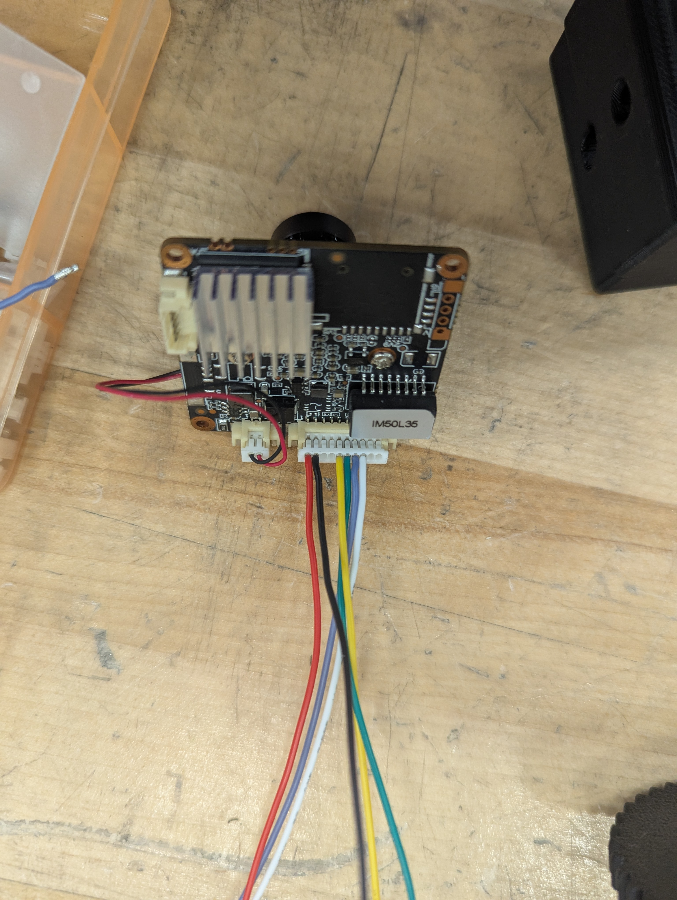

#### JST 1.25mm 10pin

| Pin | Color  | Name    |
| --- | ------ | ------- |
| 1   | Red    | VCC 12V |
| 2   | Black  | Gnd     |
| 3   | NC     | N/A     |
| 4   | NC     | N/A     |
| 5   | Yellow | TX-     |
| 6   | Green  | TX+     |
| 7   | Blue   | RX-     |
| 8   | White  | RX+     |
| 9   | NC     | N/A     |
| 10  | NC     | N/A     |

#### RJ45

Below is the rovus custom RJ45 pinout for Cameras that should be respected. Notice that only one red and one black wire comes from the camera, you can choose where they go in the RJ45 (no need to plug them both).

| Pin | Color  | Name    |
| --- | ------ | ------- |
| 1   | Green  | TX+     |
| 2   | Yellow | TX-     |
| 3   | White  | RX+     |
| 4   | Red    | VCC 12V |
| 5   | Red    | VCC 12V |
| 6   | Blue   | RX-     |
| 7   | Black  | GND     |
| 8   | Black  | GND     |
