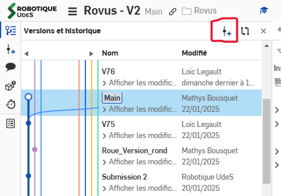
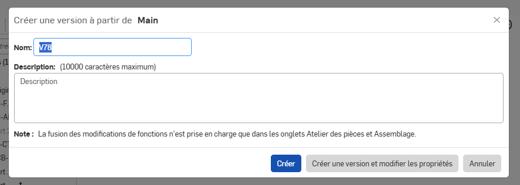

# Gestion des branches

Les branches sont utilisées pour travailler en parallèle sur une gros projet. En premier, il faut segmenter le projets et compartimenter les assemblages. Dans le rover les principales parties sont:

- Main: assemblage principal, intégration des sous-systèmes, idéalement pas de cad dans cette branche
- CHASSIS: comprends tout le chassis, le tube de rockers, le top et le couvercle.
- ROCKER: comprends les roues, les rockers et le mouvement autour.
- ARM: comprends tous les joints du bras, la pince et la plaque pour aller sur le chassis
- ELEC: comprends toute la boite électrique et tous les PCB et leur cover
- SIDE: comprends les side quests et projets en dehors du rover, panneeau de bouton et base station par exemple

 Pour recompartimenter un sous-projet, il faut écrire SOUS-PROJET:SOUS-SOUS-PROJET, ex: BRAS: JLIN.

## Créer une branche

1. Créer une version de la branche, lui donner un nom si possible
   
2. Click-droit sur la version puis donner un nom à la branche suivant les points plus hauts

## Merger 2 branches

1. Aller dans la branche qu'on veut mettre à jour
2. Click-droit dans la branche qu'on veut merger et "brancher dans l'espace de travail".
   - Choisir SEULEMENT les part studio et les assemblages qu'on veut mettre à jour.
   - Ne rien merger si on est pas sûr
   - Dans l'idéal, puisque seul une partie du système a changé, on peut écraser complètement toutes les parties

## Supprimer une branche

Seul l'administrateur au compte de Robotique UdeS peut supprimer des branches. Les directeurs mécanique de chaque projet ont les accès pour ce compte
