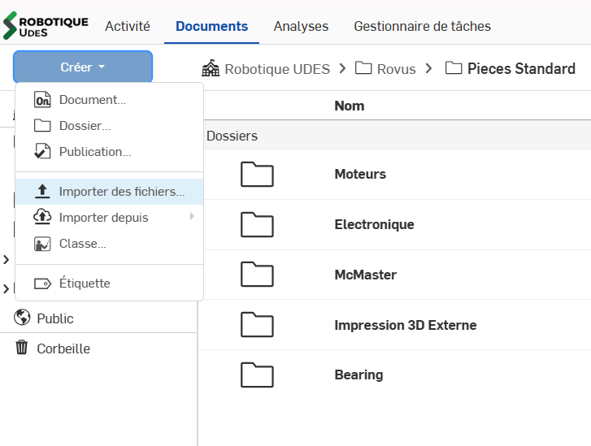
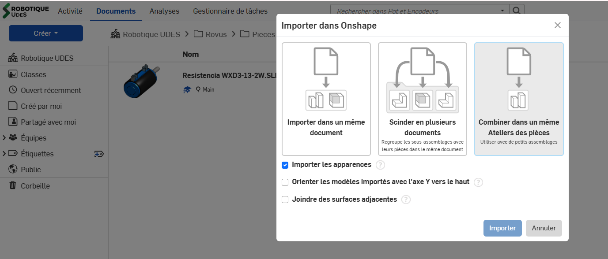
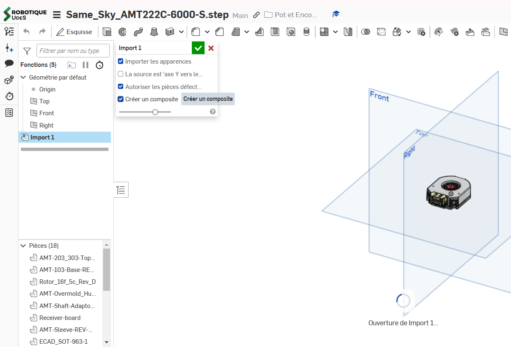
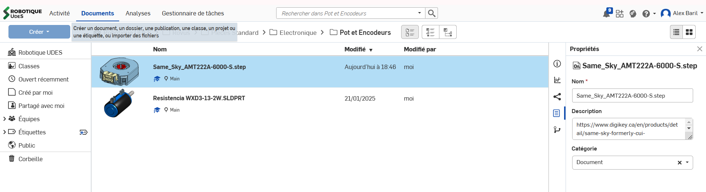

# Importer un fichier standard

## Importation de fichiers standards

Si vous importez des pièces standards dans vos designs, suivre ces étapes:

1. Downloader la pièce en format .step (step 214 préférablement)
2. Aller dans le dossier "Pieces Standard" puis dans la catégorie voulue, suivant ces règles:
   1. 1 document par pièce ou assemblage de pièces
   2. Chaque document comporte 1 atelier de pièce et 1 assemblage seulement
   3. Vous pouvez créer des dossiers en fonction de la nature de la pièce standard (pièce électronique, moteur, quincaillerie, brut, etc)
3. Importer la pièce voulu
   1. Importer des fichiers an haut à gauche et sélectionner votre fichier en .step.
   2. Sélectionner le document .step puis **IMPORTANT** sélectionner la 3ème option "Combiner dans un Atelier de pièces". Cocher "Joindre des surfaces adjacentes" au besoin si le .step est mal fait. 
   3. Ouvrir le document et double-cliquer sur la fonction "Import 1" pour sélectionner "Créer un composite". Cette option permet de grouper et faire une seule pièce pour simplifier les assemblages et les importations plus tard. 
   4. Ajouter le site d'achat ou une brève description dans la description du document 
4. Pour importer une pièce standard dans un autre Atelier de pièce ou assemblage:
   1. Atelier de pièce; faire la fonction "Dérivée" et choisir la pièce voulue. Pour la positionner à la bonne place, utiliser la fonction "Transformer" en utilisant les connecteurs de position ou des mouvements linéaires
   2. Assemblage; Insérer puis choisir "Autres documents" et trouver la pièce désirée.
