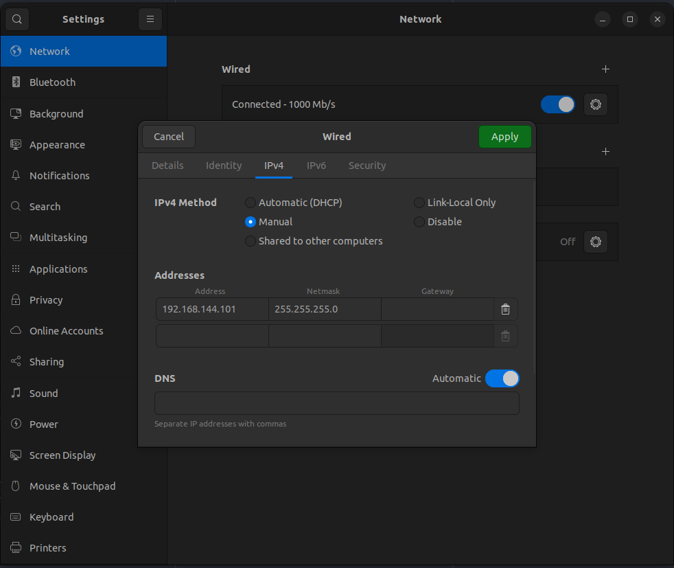

# Network Configuration

Here you will find the ip addresses and login info of each antenna as well as all the used IP addresses for all components.

## IP address table

The rover is on the 192.168.144.0/24 subnet

Personal computers must be on IP addresses between 192.168.144.100 and 192.168.144.254.

This is a table of all IP addresses used.

| IP address         | Device              |
| ------------------ | ------------------- |
| 192.168.144.20     | Main Rover PC (MCU) |
| 192.168.144.25     | Camera Main         |
| 192.168.144.40     | Camera Antenne      |
| 192.168.144.27     | TO DO               |
|                    |                     |
| **Personal PC IP** | **Name**            |
| 192.168.144.101    | Philippe Michaud    |
| 192.168.144.102    | Anibal Arango       |
| 192.168.144.103    | Charles-Éloi Lafond |
| 192.168.144.104    | Marc-Antoine Lépine |
| 192.168.144.105    | Koralie Lacasse     |
| 192.168.144.106    | Saria Berger        |

The ROS_DOMAIN_ID must be 69 on all computers to bridge the ROS communication over between computers :

```bash
export ROS_DOMAIN_ID=69
```

## Antennas

The user and password for all antennas is _rovus_.

### Rocket M2

- IP rover (Rover M2): 192.168.144.50
- IP base station (Base M2): 192.168.144.55
- SSID : rovusM2

Web Interface:

- Username: rover
- Password: rover

### Rocket M900 (old, but relevant if needed)

- IP rover (Rover M900) : 192.168.143.50 (Rick)
- IP base station (Base M900) : 192.168.143.55 (Morty)
- SSID : rovusM900

Web Interface:

- Username: rovus
- Password: rovus

### Connecting to the network

- Plug in the 2.4Ghz ethernet cable into your computer
- Set up your network like this:

  - Open ubuntu settings
  - Go to the _network tab_
  - Under wired, click the _gear_ button
  - Go to the _IPv4 tab_
  - Set _IPv4 Method_ to _Manual_
  - Enter these settings under addresses:
    _ Address: 192.168.144._ (_ should be between 100 and 255 and be reserved in the [IP address table](#IP-address-table))
    _ Netmask: 255.255.255.0 \* Gateway: Leave empty
    
  - Reset the network interface (set to off than to on)
    - To check if the new config was applied, enter this command in a terminal:
    - `ifconfig | grep <ENTER ADDRESS> `
    - If a line like this: `inet <YOUR IP> netmask:255.255.255.0 ...` appear, your all set.

> [!NOTE]
> When using USB to Ethernet adapters, you'll need to make the configuration for each different adapters

### Wireless Setup

> [!WARNING]
> Problems have been notices when using a cheap router with ROS sending a lot of small packets very fast (joy msgs). This connection can be buggy and flaky

Its possible to connect to the rover without the big base station antenna, it's very useful for small range tests. There's a small router configured as wireless LAN access point. When connected to this wifi network, you'll be able to access all the LAN network off the rover (M2.4, MCU, Cams, etc.)

Connection information:

- Router configuration interface

  - password: rover

- Wifi network
  - SSID: rovus_low_range
  - password: roverrover
