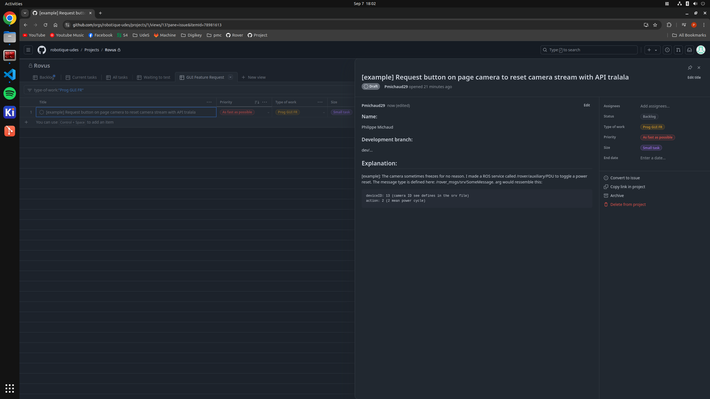

# Feature request

If you want to request new features on the GUI, create a new task into the github project and set at least these flag:

- type of work: Prog GUI FR
- Priority: same as the task your working on
- Size: According to your knowledge
- Description:

  - Follow this markdown template

    ```md
    ### Name:

    _name of requester_

    ### Development branch:

    _repo name_
    _full branch name_

    ## Explanation:

    Add as much detail as possible to help implementation
    ```

Example:

