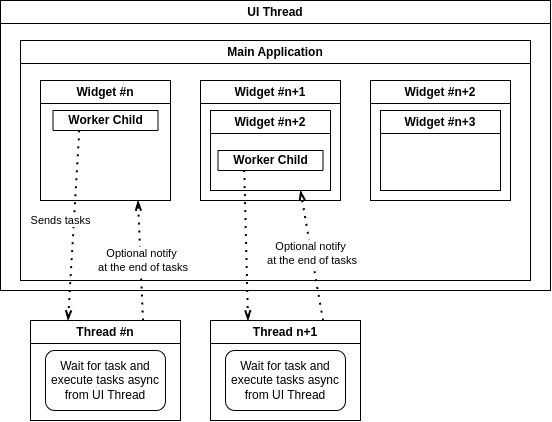

# How to use the rover GUI

The GUI is a [Qt6](https://doc.qt.io/qt-6/) application and a ROS node which communicates with the rest of the rover.

## Launching the app

To launch the app only, run the following command (don't forget to build):

```bash
ros2 run rover_gui main_gui
```

To run the GUI and the rest of the rover run:

```bash
ros2 launch rover_msgs base.launch.py
```

In another terminal (only necessary if not connected with the rover (standalone))

```bash
ros2 launch rover_msgs rover.launch.py
```

If you encounter errors when building make sure to update your [dependencies](../../../General%20information.md#dependencies).

## Software development on the roverGUI

### How to create and compile a .ui file

Using **Qt Designer**, you can create `.ui` files which gives a visual feedback of UI elements and can speed-up the development process. To create a `.ui` file, follow theses steps:

1. Open **Qt 5 Designer** (the app should have installed with the ROS installation)
2. Create or open a new _<file_name>.ui_ file (should be a _Widget_ and NOT a _Main Window_)
3. Build the desired UI
4. Save the file in the `rover/rover_gui/ui/ui` folder
5. Generate the .h file from the .ui file
   - Automatically with
     ```bash
     b # or colcon build
     ```
   - Manually with:
     ```bash
     cd ~/ros2_ws/src/rover/rover_gui/ui
     ./generate_ui.sh # Can probably be added to the CMakeFile
     ```
6. A `UI_<file*name>.h` should have generated inside of `rover/rover_gui/ui/include/`
7. Include the .h file in your app

   ```cpp
   #include "UI_<file_name>.h"
   ```

8. Call `setupUI(this)` in your widget

   ```cpp
   #include "UI_MyUIFile.h"

   class MyWidget : public QWidget
   {
   public:
   	MyWidget(QWidget* parent_): QWidget(parent)
   	{
   		_ui.setupUi(this);
   	}
   	~MyWidget();

   private:
   	Ui::MyUIFile _ui;
   };
   ```

9. Finally, compile and execute your app

## QT Application architecture


The goal of the diagram is to highlight that all the UI elements must be managed and controlled inside the UI Thread (main application thread where the `int main(void)` function is defined). But all the other tasks should be done inside [workers](#QWorker) which handle async tasks to not keep the UI Thread from hanging.

## QT Signals and Slots

TODO: Link to Qt documentation

## QWorker

See the [architecture](#QT%20Application%20architecture) to understand where the worker is located. A worker is our custom way of running task in the background. Since the GUI needs to be updated very fast to create a smooth experience for the user, we'll want to do all the tasks that doesn't need to interact with the UI elements in a parallel way ([multithreading](https://hackernoon.com/multithreading-for-beginners-step-by-step)). When using our worker, you don't need to manage the multithreading and safe ressource sharing, it's done inside the worker. To use one you can either create a Worker child class, or add a worker as a class member.

#### Usage

Call the `QWorker::addTask()` method with a [lambda function](https://dev.to/glpuga/c-lambdas-for-beginners-313c) to start a task in the background. Checkout the `rover/rover_gui/src/QSshFileExplorer/QSshWorker.hpp` file for a concrete example. Instead of returning an argument, emit a signal and provide your Widget class (which includes a worker) a method to retrieve the updated data.

As of now, the default QWorker queues all the tasks added with `QWorker::addTask()` and execute them as fast as possible. Nice additions would be to implement different Worker types:

- Parallel task handling
- Repeating periodic task handling

### ROS communication

TODO
